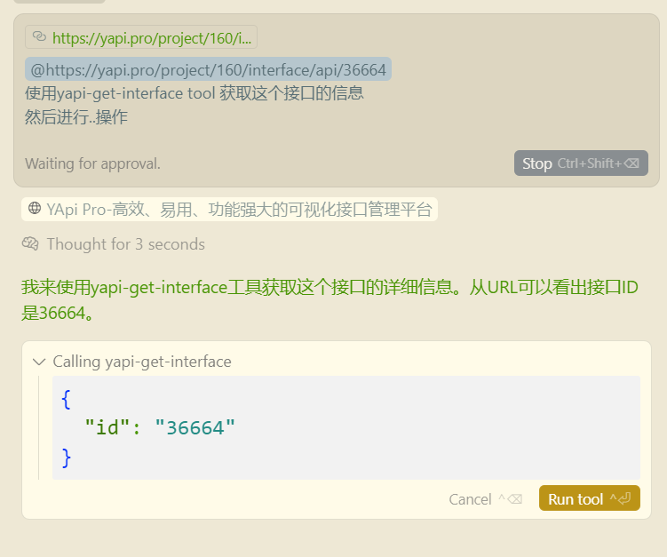

# yapi-get-interface-mcp

一个用于获取YAPI接口详情的MCP（Model Context Protocol）服务器，支持与Cursor、Claude Desktop等AI开发工具集成。


## 使用方法

### 可用工具

#### yapi-get-interface
根据接口ID获取YAPI接口详情

**参数：**
- `id`：接口ID（数字格式）

**使用示例：**


AI工具会自动调用该工具并返回接口的完整信息，包括：
- 接口基本信息（名称、路径、方法等）
- 请求参数（路径参数、查询参数、请求头、请求体）
- 响应信息（响应体、响应类型等）
- 其他元数据（创建时间、状态、标签等）

### 命令行参数

| 参数 | 说明 | 必需 | 示例 |
|------|------|------|------|
| `--email` | YAPI登录邮箱 | 是 | `--email admin@company.com` |
| `--password` | YAPI登录密码 | 是 | `--password mypassword` |
| `--url` | YAPI服务器地址 | 是 | `--url https://yapi.company.com` |


## 快速开始

#### 在Cursor中配置

创建或编辑 `.cursor/mcp.json` 文件（项目级配置）或 `~/.cursor/mcp.json` 文件（全局配置）：

```json
{
    "mcpServers": {
        "yapi-get-interface-mcp": {
            "command": "npx",
            "args": [
                "yapi-get-interface-mcp",
                "--email", "your@email.com",
                "--password", "yourpassword", 
                "--url", "https://yapi.yourcompany.com"
            ]
        }
    }
}
```

## 环境要求

- Node.js >= 18.0.0
- pnpm >= 8.0.0

## 安装

使用npx可以直接运行，无需本地安装：

```bash
# 克隆项目
git clone https://github.com/Gorvey/yapi-get-interface-mcp.git
cd yapi-get-interface-mcp

# 安装依赖
pnpm install

# 构建项目
pnpm run build
```


## 开发指南

### 项目结构

```
src/
├── config/           # 配置管理
│   └── yapi-config.ts
├── server/           # MCP服务器
│   ├── server.ts
│   ├── tools.ts
│   └── resources.ts  
├── yapi/             # YAPI客户端
│   └── client.ts
└── index.ts          # 入口文件
```

### 开发脚本

```bash
# 开发模式（带示例配置）
pnpm run dev

# 监听文件变化自动构建
pnpm run watch

# 清理构建文件
pnpm run clean

# 构建项目
pnpm run build

# 使用MCP Inspector调试
pnpm run inspector
```

### 调试

使用MCP Inspector进行调试：

```bash
pnpm run inspector
```

这将启动一个交互式界面，帮助你测试和调试MCP工具。

## 常见问题

### 1. YAPI连接失败
- 检查YAPI服务器地址是否正确
- 确认邮箱和密码是否正确
- 检查网络连接和YAPI服务器可访问性

### 2. 接口ID无效
- 确保接口ID是数字格式
- 检查接口在YAPI中是否存在
- 确认有访问该接口的权限

### 3. MCP服务器未被识别
- 确保已正确构建项目（`pnpm run build`）
- 检查配置文件中的路径是否正确
- 重启AI开发工具

## 许可证

MIT License

## 贡献

欢迎提交Issue和Pull Request来改进这个项目。

## 更多信息

- [MCP协议文档](https://modelcontextprotocol.io/)
- [Cursor MCP集成文档](https://docs.cursor.com/integrations/mcp)
